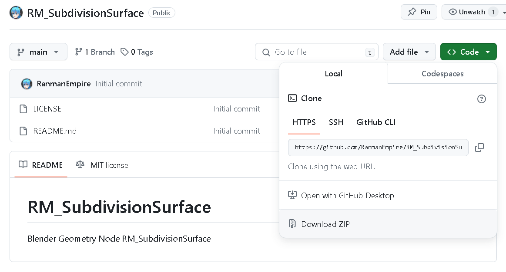
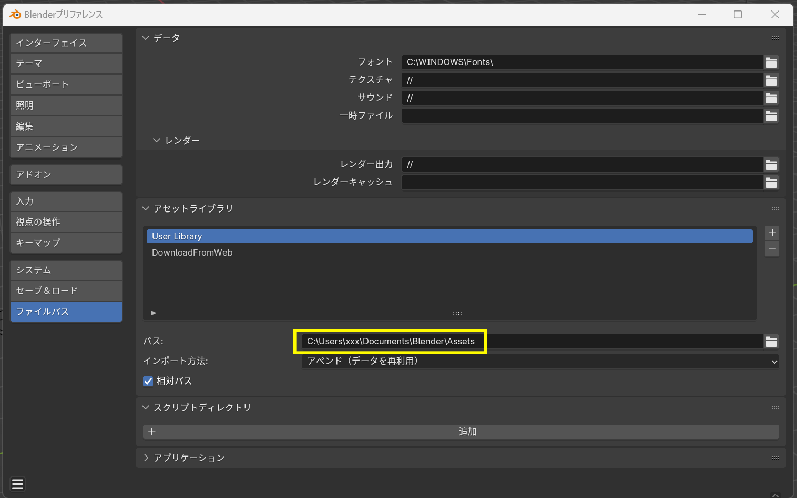
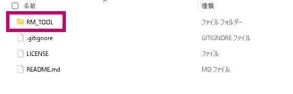
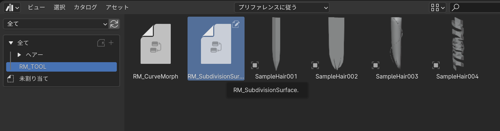
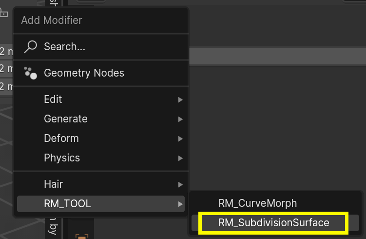

# RM_SubdivisionSurface
- **RM_SubdivisionSurface**は3DCGソフトBlenderのジオメトリーノード製のツールです。オブジェクトのメッシュを細分化し滑らかにします。RM_SubdivisionSurfaceではメッシュの痩せ・太り具合、スムーズをコントロールできます。
  

---

### 動作バージョン
- Blender 4.0.0以降

### インストール方法
- **RM_SubdivisionSurface**はBlenderのアドオンではなくジオメトリーノードです。そのためアセットライブラリに登録して使用するといいでしょう。アセットライブラリに登録されるとオブジェクトのモディファイアーのリストに表示されるようになります
- GithubのRM_SubdivisionSurfaceのページからzipファイルをダウンロードし、解凍します
  

- Blenderの【プリファレンス】→【ファイルパス】→【アセットライブラリ】を開いてください。アセットライブラリとして使用できるフォルダパスが確認できます。このフォルダパスに先ほど解凍した中から「RM_TOOL」フォルダをコピーします。
  
  

- Blenderを再起動してアセットライブラリを表示するとRM_TOOLの項目があり、その中に「RM_SubdivisionSurface」が入っていればアセットライブラリへの登録は成功です。
  

### 使用方法
- アセットライブラリへの登録が済んでいれば、モディファイアの一覧の中にRM_TOOL→RM_SubdivisionSurfaceが表示されているので、モディファイアとして選択してください。
  

### 設定項目
|項目|効果|
|---|---|
|Subdivision Level|メッシュの細分化数を指定します|
|VolumeControl|メッシュの細分化後の痩せ・太りをコントロールします**値は直接入力で-1から1以上の数値も入力できます。**|
|Subdivision Smooth|メッシュの細分化後のスムーズをコントロールします*0はメッシュの細分化をされたものになります*|
|UV Smooth|細分化の際のUVの挙動を指定します 内容は従来のSubdivisionSurfaceと同等のものです ジオメトリーノードに現在コンボボックス入力がないため 整数値入力になっております コンボボックス入力が使えるようになったら直します  0;None(なし) 1:Keep Corners(コーナーを維持) 2:Keep Corners, Junctions(コーナーと接点を維持) 3:Keep Corners, Junctions, Concave(コーナー,接点,凹面を維持) 4:Keep Boundaries(境界を維持) 5:All(全て)|
|Boundary Smooth|細分化の際のメッシュのコーナーについての挙動を指定します 内容は従来のSubdivisionSurfaceと同等のものです ジオメトリーノードに現在コンボボックス入力がないため 整数値入力になっております コンボボックス入力が使えるようになったら直します  0:Keep Corners(コーナーを維持) 1:All(全て)|
|Edge Crease|メッシュの辺に設定したクリースの適用度をコントロールします|
|Vertex Crease|メッシュの頂点に設定したクリースの適用度をコントロールします|

### バグ報告・機能追加要望についてのお願い
- 使用中にバグを発見した際・追加機能の要望があればぜひ作者までご連絡ください。それぞれご対応いたします。

### 更新履歴
- 2024/03/31 Githubに公開

### 免責事項
- 本ツールは、使用者の責任にて使用することを前提として提供されます。本ツールの妥当性や結果に関する判断は使用者が行うべきものであり、著作権者は使用結果に関して何らの保証をするものではなく、どのような形でも責任を負いません。著作権者は本ツールの仕様、もしくは使用不能に起因して生じた利益の損失、障害、その他の金銭的な損害を含め、いかなる特定の偶発的、間接的、もしくは派生的損害についても責任を負いません。